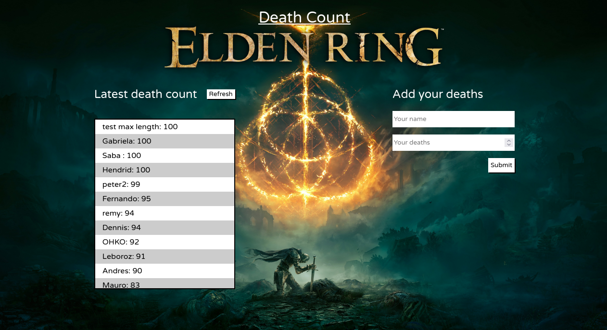

# Leaderboard

> Keep a record of users' scores. Use async functions to consume the API, `POST` new scores and `fetch` the updated scoreboard.

# Live Version
This is the [link](https://eduardosancho.github.io/Leaderboard/dist/index.html) that will direct you to the live version.




## Built With

- Languages: HTML, CSS, Javascript
- Frameworks
- Technologies used: Webpack


## Getting Started

To get a local copy up and running follow these simple example steps.

### Setup
Clone this repo into your local device by running the following command on your Terminal:
```
git clone git@github.com:eduardosancho/Leaderboard.git
```

That will create a folder with the project inside it. Navigate into it to access the files.

Also remember to run:
```
npm install
```
This will update the dependencies and download necessary files.
### Usage
Before you begin testing and experimenting, remember to use the Terminal to create a branch by running:
```
git checkout -b branch-name
```

After that you should be ready to go.
### Run tests
Before pushing changes to your branch, I would recommend opening this file:

```
/.github/workflows/linters.yml
```

install and run webhint, stylelint, and eslint

These linters will help you fit your code to this repo's syntax standard.
### Deployment
Once you're done with your changes, remember to ```git pull``` before doing ```git push``` this will update 
your local copy of the project if someone else made changes to the repo while you worked on your part.


## Author

👤 **Eduardo Sancho Solano**

- GitHub: [@eduardosancho](https://github.com/eduardosancho)
- Twitter: [@sanchitobless](https://twitter.com/sanchitobless)
- LinkedIn: [Eduardo](https://www.linkedin.com/in/eduardo-sancho-043641181/)

## 🤝 Contributing

Contributions, issues, and feature requests are welcome!

Feel free to check the [issues page](../../issues/).

## Show your support

Give a ⭐️ if you like this project!

## Acknowledgments

- Hat tip to anyone whose code was used
- Inspiration
- etc

## 📝 License

This project is [MIT](./MIT.md) licensed.
